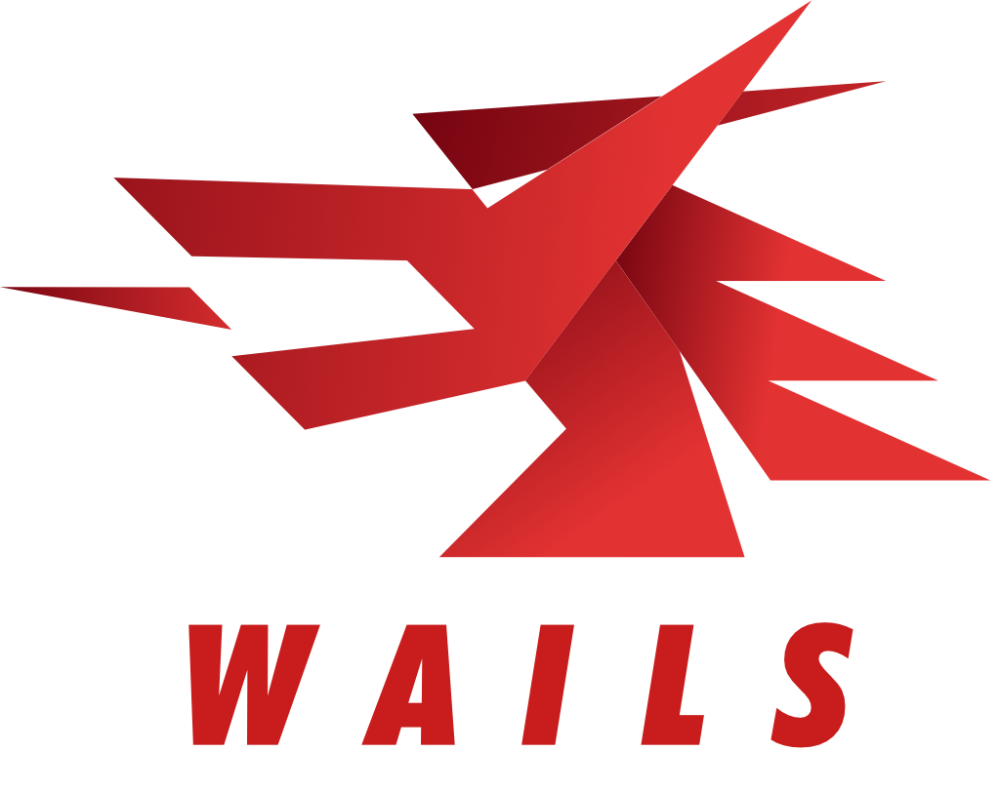

# VibeCraft

  
  <h3>Create Mesmerizing Videos with Ease</h3>

**VibeCraft** is a cross-platform desktop application that lets you create stunning, customizable videos. Built with Wails (Go backend, React frontend), it comes with a default generator and supports custom generator imports.

## ✨ Features

- 🎯 **Default Generator**: Bouncing ball in a circle with customizable parameters
- 🔌 **Custom Generator Import**: Import your own generators via `.js` files
- ⚙️ **Global Settings**: Duration (1-60s), framerate (30/60/120 FPS), output format
- 👁️ **Real-time Preview**: See your animation before generation
- 📤 **Video Export**: Generate WebM videos (MP4 with FFmpeg)
- 💾 **Local Storage**: Imported generators are saved for reuse
- 🎨 **Modern UI**: Responsive interface with Tailwind CSS

To Write